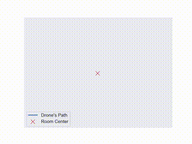
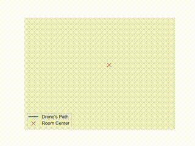
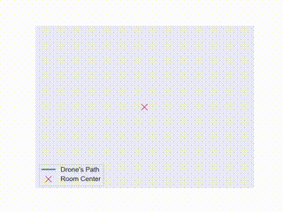

# LangCrazySwarm

LangCrazySwarm is a project that integrates the CrazySwarm framework with LangChain workflows based on LangGraph, enabling advanced drone management.

<p align="center">
  
  
  
</p>
<p align="center">
  
  
  
</p>

## Installation

#### Environment Setup

1. Install the Conda environment:
    ```
    conda env create -f environment.yml -n langcrazyswarm
    conda activate langcrazyswarm
    ```

#### CrazySwarm Installation

2. Follow the [CrazySwarm installation guide](https://crazyswarm.readthedocs.io/en/latest/installation.html) for both physical robots and simulation, ensuring your Conda environment is activated.

3. Install additional dependencies:
    ```
    conda install conda-forge::python-orocos-kdl
    pip install PyQT5
    ```

#### LangCrazySwarm Setup

4. After completing the CrazySwarm installation:
    - Copy the `run_swarm.py` script to the CrazySwarm scripts directory. From the CrazySwarm root, this folder is located at: `ros_ws/src/crazyswarm/scripts/`.
    - Create a `.env` file in the same directory to store the necessary API keys for workflows with LangGraph. Below is an example of .env content:
        ```
        # OpenAI API Key
        OPENAI_API_KEY=YOUR_OPENAI_API_KEY

        # LangSmith for Workflow Tracing
        LANGCHAIN_TRACING_V2=true
        LANGCHAIN_ENDPOINT="https://api.smith.langchain.com"
        LANGCHAIN_API_KEY=YOUR_LANGCHAIN_API_KEY
        LANGCHAIN_PROJECT=YOUR_LANGCHAIN_PROJECT_NAME
        ```
        **Note**: You can generate the required LangSmith keys by creating a new project on [LangSmith](https://smith.langchain.com/).

<!-- ## VisPy Visualization (optional)

If you wish to be able to visualize in VisPy, add the following lines of code to `visVispy.py` in `crazyswarm/scripts/pycrazyswarm/visualizer`: -->

## Running

#### Simulation

To run the script in a simulator, use the following command from the `ros_ws/src/crazyswarm/scripts/` directory:
```
python run_swarm.py --sim --vis vispy
```

Ensure that you have sourced the necessary setup files for CrazySwarm by running:
```
source ../../../devel/setup.bash
```

This will set up the environment for running the simulation.

#### Physical Robots

To run the system on physical Crazyflies, first, set up the hardware as described in the [CrazySwarm installation guide](https://crazyswarm.readthedocs.io/en/latest/installation.html). Then, run the following command from the `ros_ws/src/crazyswarm/scripts/` directory:
```
python run_swarm.py
```

This will start the swarm with the physical robots.

## Producing Path Animations

To generate animations of drone paths captured by Vicon:
1. Ensure your Vicon data CSV file is formatted correctly:
    - Delete the first 3 rows if needed, as `pandas` requires a clean header for proper parsing.
2. Run the following command:
    ```
    python process_data.py
    ```